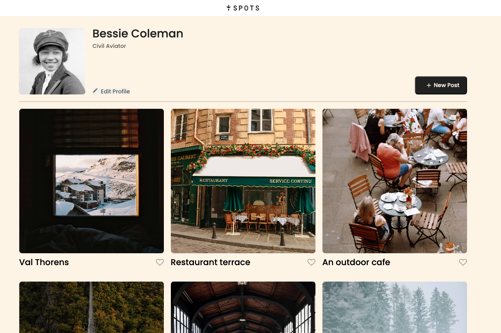

# Project 3: Spots

https://stuartuseljones.github.io/se_project_spots/

### Overview

- Intro
- Video Overview
- Description of Process
- Visuals
- Next Steps

**Intro**

\*Update: on this same project, I incorporated JavaScript for several purposes. Opening and closing modals, creating new cards, and setting up validation when filling out the form.

This project is made so all the elements are displayed correctly on popular screen sizes. It was created in a desktop layout then adapted with Grid and media queries to fit several different device sizes.

**Video Overview**

Check out these videos, where I describe my project and some of the challenges I faced while building it:

- First Website Iteration Video https://drive.google.com/file/d/1NKjVCIA8SYKITkTLChjZY52n4MsYYVlk/view?usp=sharing
- Second Iteration Video (API's) https://drive.google.com/file/d/111lox1C1_qSaqIoc58uz32jLYMX9hW6W/view?usp=sharing

**Description of Process**

This project was built utilizing Visual Studio Code while referencing the design created by TripleTen in Figma. The Spots project was verified and checked utilizing developer mode in Chrome. Especially when it came to checking the page's responsiveness. Great help from Prettier, Dot, and the tutors at TripleTen as well on Discord.

**Visuals**

Desktop width:

Tablet width:

Mobile width:

**Next Steps**

Nothing to note. Open to improvements.

Be well and enjoy!
